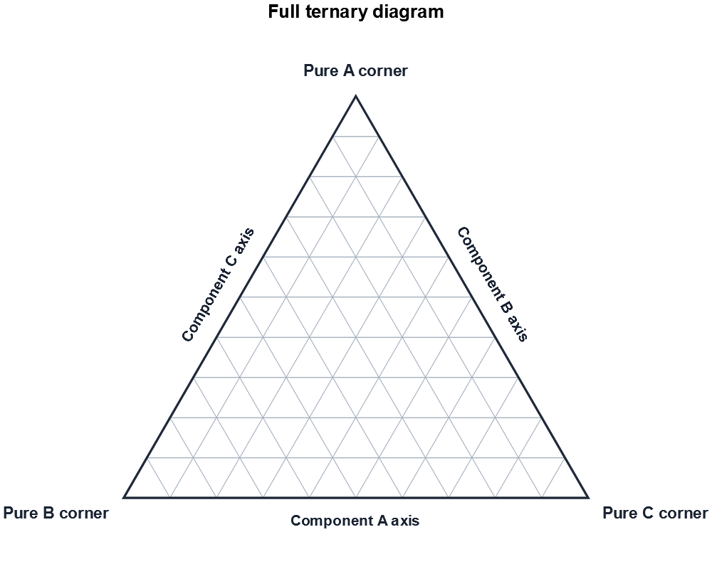
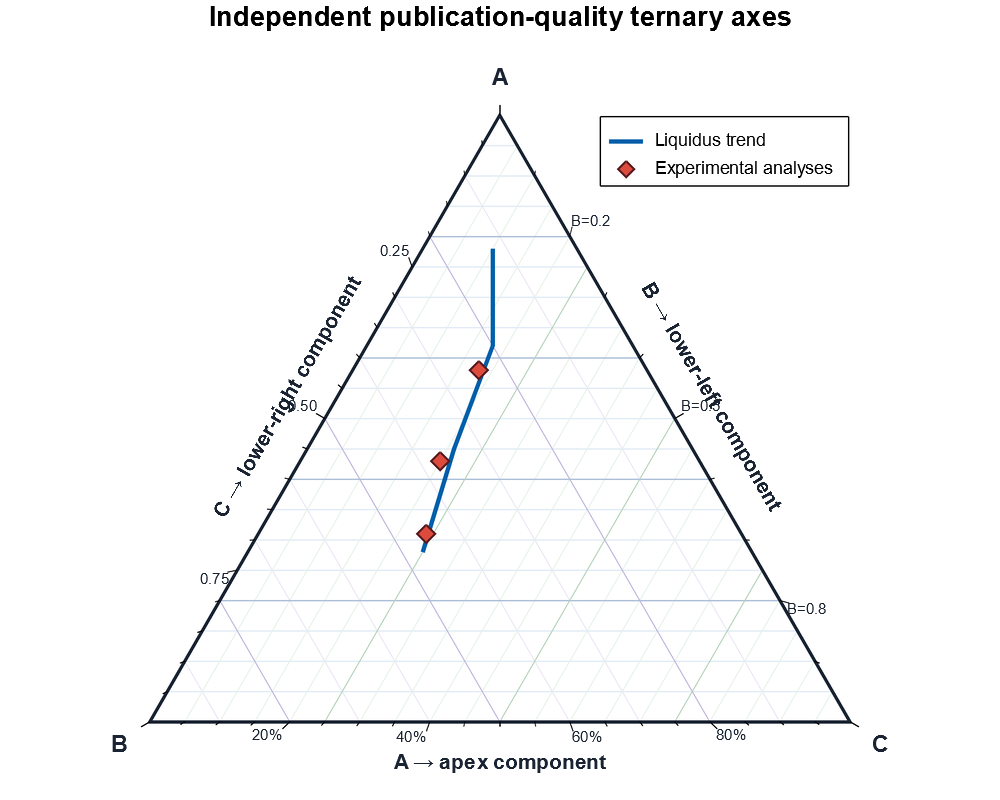
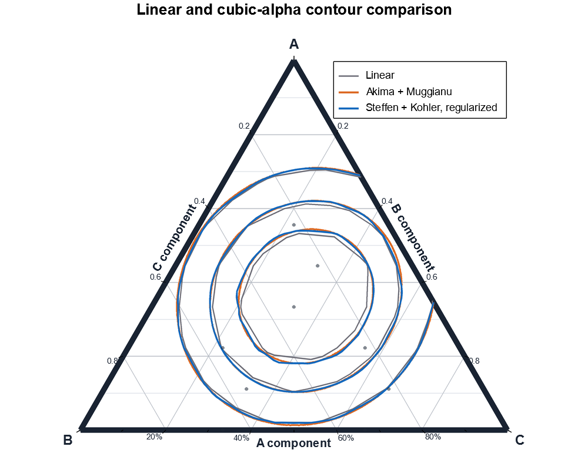
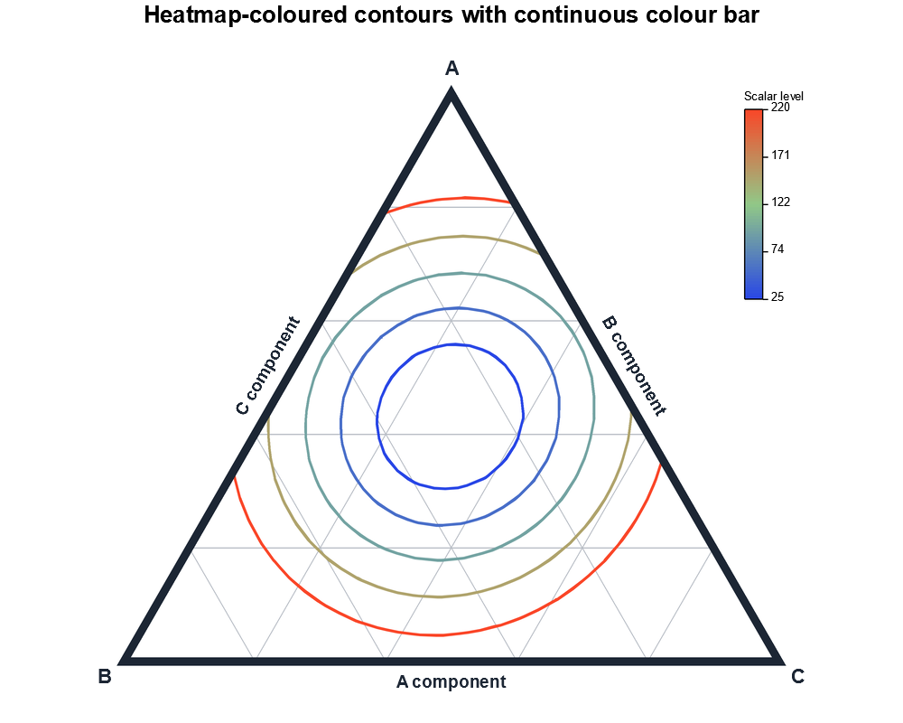
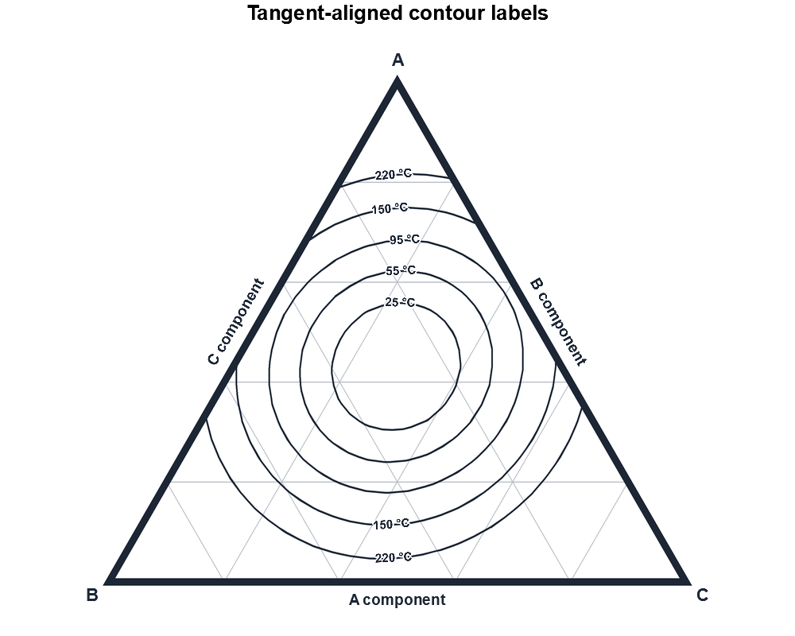
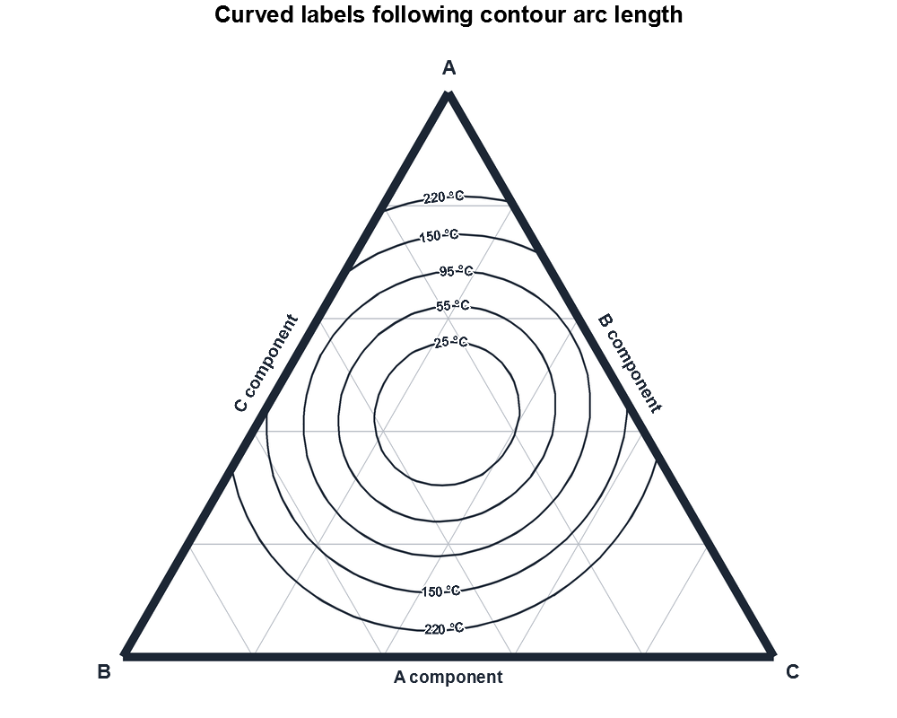

# plotters-ternary

`plotters-ternary` adds publication-quality ternary composition diagrams to
[Plotters](https://crates.io/crates/plotters). It keeps A/B/C compositions,
logical viewport clipping, regular-grid contours, and scientific drawing
primitives separate from backend rendering, while preserving ordinary Plotters
captions, styles, `SeriesAnno`, and legends.

## Capabilities

- validated ternary compositions, configurable vertex order, upward/downward geometry;
- full, cropped, and interior logical viewports with invisible mathematical clipping;
- publication-oriented A/B/C axes, grids, ticks, labels, and native SVG rotated axis names;
- exact/smooth lines, scientific markers, polygons, annotations, and normal Plotters legends;
- regular-grid line contours: piecewise-linear or optional cubic-alpha;
- PNG output with optional geometry-only supersampling and native vector SVG.

## Installation

```toml
[dependencies]
plotters-ternary = "0.1.0"
plotters = "0.3.7"
```

Enable cubic-alpha contour construction when needed:

```toml
plotters-ternary = { version = "0.1.0", features = ["cubic-alpha"] }
```

The feature enables cubic contour construction only. `spline1d` remains a
normal transitive dependency because smooth line series also use it.

## Minimal chart

```rust,no_run
use plotters::prelude::*;
use plotters_ternary::prelude::*;

let root = BitMapBackend::new("ternary.png", (1000, 800)).into_drawing_area();
root.fill(&WHITE)?;
let mut chart = TernaryChartBuilder::on(&root)
    .caption("Ternary diagram", ("sans-serif", 32))
    .margin(60)
    .build()?;
chart.configure_mesh()
    .corner_a_name("A")
    .corner_b_name("B")
    .corner_c_name("C")
    .draw()?;
# Ok::<(), Box<dyn std::error::Error>>(())
```

For a cropped diagram, select a logical viewport; it never becomes a visible
Cartesian frame:

```rust,no_run
# use plotters_ternary::{TernaryChartBuilder, TernaryViewport};
# use plotters::prelude::*;
# let root = BitMapBackend::new("cropped.png", (1000, 800)).into_drawing_area();
let mut chart = TernaryChartBuilder::on(&root)
    .viewport(TernaryViewport::new(0.42, 0.90, 0.05, 0.58)?)
    .build()?;
# Ok::<(), Box<dyn std::error::Error>>(())
```

## Series, markers, axes, and annotations

Use `TernaryLineSeries`, `TernaryPointSeries`, `TernaryPolygon`, and
`TernaryText` through `chart.draw_series(...)`. The return value is Plotters'
native annotation, so legends remain ordinary Plotters legends:

```rust,no_run
# use plotters::prelude::*;
# use plotters_ternary::{TernaryChartBuilder, TernaryLineSeries, TernaryPoint};
# let root = BitMapBackend::new("series.png", (1000, 800)).into_drawing_area();
# let mut chart = TernaryChartBuilder::on(&root).build()?;
chart.draw_series(TernaryLineSeries::new(
    [TernaryPoint::new(0.7, 0.2, 0.1), TernaryPoint::new(0.2, 0.5, 0.3)],
    BLUE.stroke_width(2),
))?
.label("Measured boundary")
.legend(|(x, y)| PathElement::new([(x, y), (x + 20, y)], BLUE.stroke_width(2)));
chart.configure_series_labels().draw()?;
# Ok::<(), Box<dyn std::error::Error>>(())
```

See the source examples for [markers and legends](examples/lines_points_legend.rs),
[custom axes](examples/custom_axes.rs), and
[phase regions and annotations](examples/regions_annotations.rs).

## Contours

The backend-independent `ternary-contours` dependency constructs complete
semantic A/B/C contour paths. This crate only projects and visually clips those
final paths for Plotters. Backend, viewport, output-size, style, and
supersampling choices cannot change the numerical `ContourSet`.

`ContourInterpolation::Linear` is the exact piecewise-affine baseline on a
regular ternary grid. Cubic-alpha contours reuse directed one-dimensional
`spline1d` intervals along every shared grid edge and use adaptive topology
extraction plus optional level-preserving regularization.

```rust,no_run
# use plotters_ternary::{ContourOptions, ContourSet, RegularTernaryScalarField};
# let field = RegularTernaryScalarField::from_fn(1, |[a, b, c]| 2.0 * a - 3.0 * b + 5.0 * c)?;
let contours = ContourSet::compute(&field, &[0.5, 1.0], ContourOptions::linear())?;
# Ok::<(), Box<dyn std::error::Error>>(())
```

For cubic-alpha use `ContourOptions::cubic_alpha(CubicAlphaOptions { .. })`.
`Muggianu` is the default symmetric binary projection:
`xj + xk/2`. `Kohler` preserves the binary ratio: `xj/(xi+xj)`. Both retain
the required raw `xi*xj` pair prefactor and reproduce the same source spline
on the binary edge. `RawBarycentric` is explicitly experimental and should not
be described as Muggianu.

Contour rendering can use one style, an ordered palette, an exact-level style
callback, or a normalized continuous colour map. `ContourLegendPolicy`
registers selected levels through ordinary Plotters annotations and legends;
`ContourColorBar` provides horizontal or vertical continuous keys for dense
levels. `ContourLabelConfig` supports deterministic tangent, curved, repeated,
and manual labels. Label placement is a final chart-space calculation and never
changes the numerical contour coordinates.

```rust,ignore
chart.draw_series(
    TernaryContourSeries::new(&contours)
        .style_by_level(|level| level_style(level))
        .legend_policy(ContourLegendPolicy::EveryNth(2))
        .level_formatter(|level| format!("{level:.0} °C")),
)?;
chart.draw_contour_labels(
    &contours,
    &ContourLabelConfig::new()
        .formatter(|level| format!("{level:.0} °C")),
)?;
```

Portable PNG labels use the final-resolution antialiased rotated-text renderer.
SVG output uses searchable native transformed `<text>` elements. Curved labels
use per-character Plotters metrics where full glyph shaping is unavailable; see
[the contour-rendering architecture note](docs/architecture/contour-rendering.md).

## Gallery

| Full chart | Axes and markers | Contours |
| --- | --- | --- |
|  |  |  |
| Coloured contours | Tangent labels | Curved labels |
|  |  |  |

More references: [cropped axes](examples/output/png/cropped_axes.png),
[markers](examples/output/png/custom_markers.png),
[regions](examples/output/png/regions_annotations.png), and
[cropped contours](examples/output/png/cropped_contours.png). SVG counterparts
live beside every PNG under `examples/output/svg/`.

## Features and limits

- `default`: geometry, Plotters charting, all standard series, linear contours.
- `cubic-alpha`: cubic-alpha contour field construction and adaptive contouring.

The crate provides linear filled contour bands and flat-colour
piecewise-linear scalar maps. It does not provide cubic-alpha filled contours,
irregular or scattered-data triangulation, Kuhn simplices, N-component grids,
or C1 cubic field continuity. SVG is the preferred publication-quality output. PNG
supersampling is an example/output helper, not a permanent chart API.


## Foreground triangle frame

The ternary simplex edge is the mathematical centreline of the visual frame.
A boundary width is centred on that edge: half lies inside the simplex and half
lies outside it. Lines, contours, polygon outlines, bands, and scalar-map
microtriangles are still clipped to the mathematical domain; a foreground frame
then masks their inner edge in the final rendering.

For publication figures with data, freeze the mesh and draw its phases around
the series. This preserves Plotters-native annotations and legends while making
the correct order explicit:

```rust,ignore
let mesh = chart.configure_mesh()
    .boundary_style(BLACK.stroke_width(8))
    .build();
mesh.draw_background(&mut chart)?; // minor and major grids
chart.draw_series(my_lines)?;
chart.draw_series(my_contours)?;
mesh.draw_foreground(&mut chart)?; // joined physical boundary and ticks
mesh.draw_text(&mut chart)?;       // labels at final text resolution
```

A complete triangle frame is emitted as deterministic filled miter-limited
boundary strips, not as three independently round-capped strokes. In a cropped
viewport only visible physical simplex-edge fragments are drawn; artificial
rectangular viewport sides remain invisible and crop cuts use butt ends. The
PNG geometry pass uses the same order at the supersampled resolution, while SVG
keeps the frame and data as vector geometry. Markers retain their existing
centre-clipping policy. In the recommended workflow they are data geometry, so
the foreground frame masks their inner edge.

## Architecture and contribution

Architecture notes are under [docs/architecture](docs/architecture/README.md).
The editable contour knowledge base is under
[docs/knowledge-base](docs/knowledge-base/README.md). Contributions are
welcome; see [CONTRIBUTING.md](CONTRIBUTING.md). The crate is dual licensed
under [MIT](LICENSE-MIT) or [Apache-2.0](LICENSE-APACHE).

## Linear filled bands and scalar maps

ContourBandSet computes deterministic linear isoband regions from finite,
strictly increasing breaks. Scalar ownership is half-open while adjacent
polygons may share only zero-area threshold curves. TernaryContourBandSeries
fills the core's non-overlapping fragments, so ContourRegion holes are
transparent cut-outs that reveal layers below. TernaryScalarMapSeries evaluates
the exact piecewise-linear field at microtriangle centroids and flat-fills each
microtriangle; it is an approximation of continuous colour shading. Both retain
SVG vector geometry, and map resolution trades SVG size for visible faceting.
Cubic-alpha isobands are explicitly not supported yet.