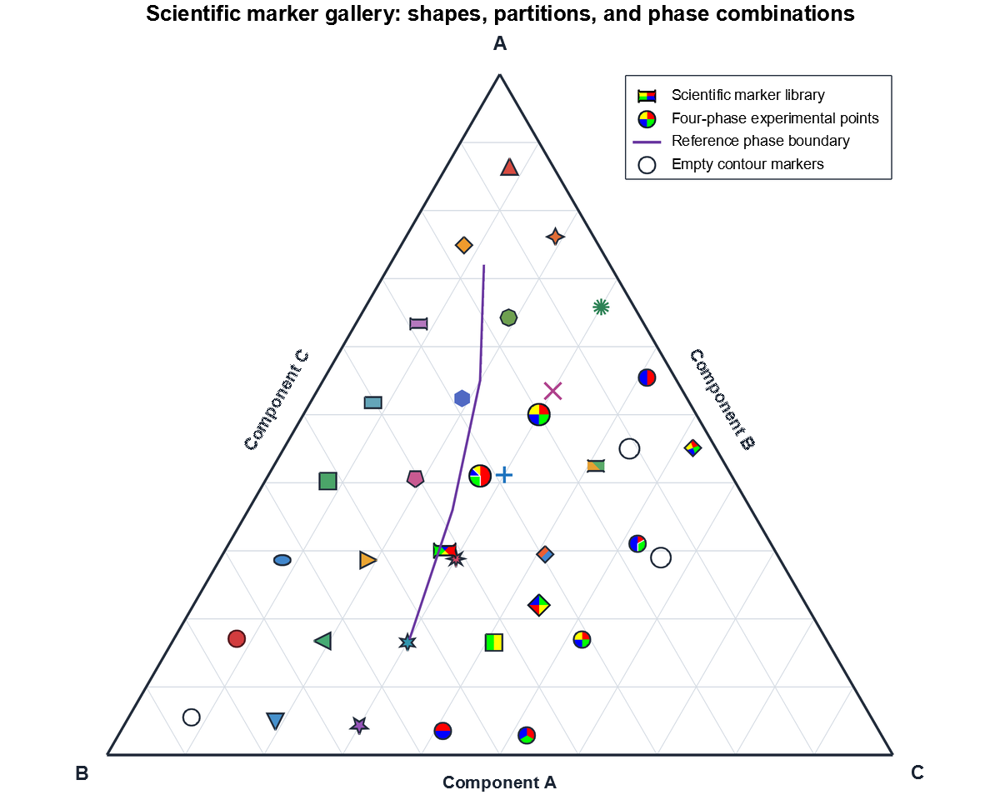
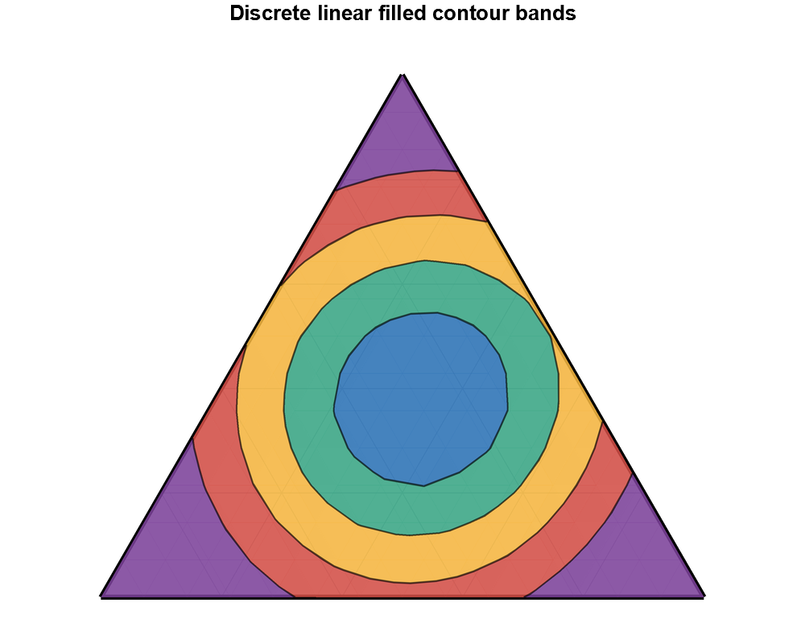
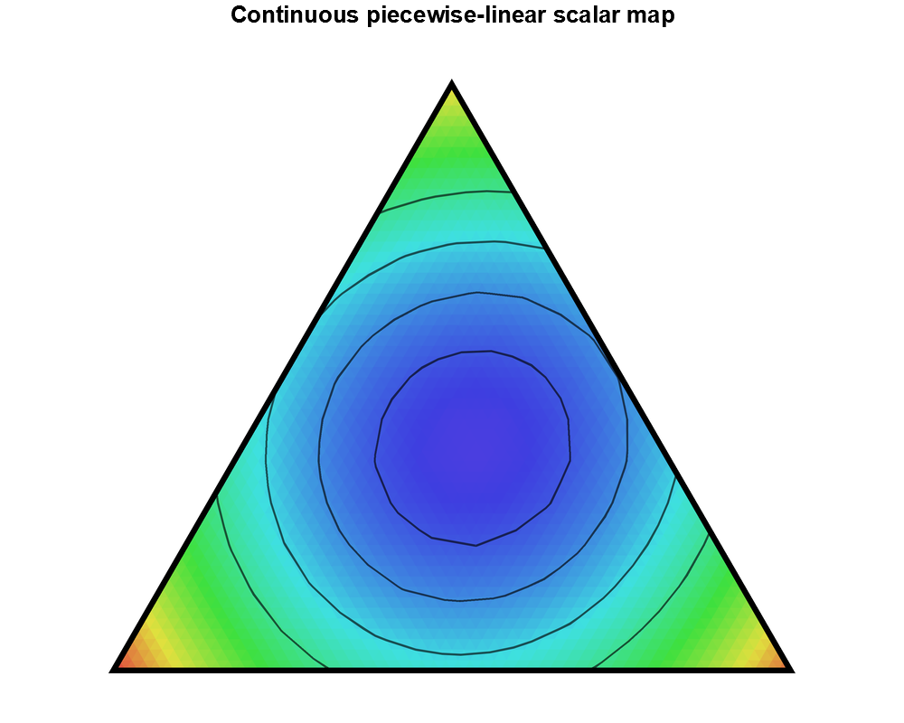
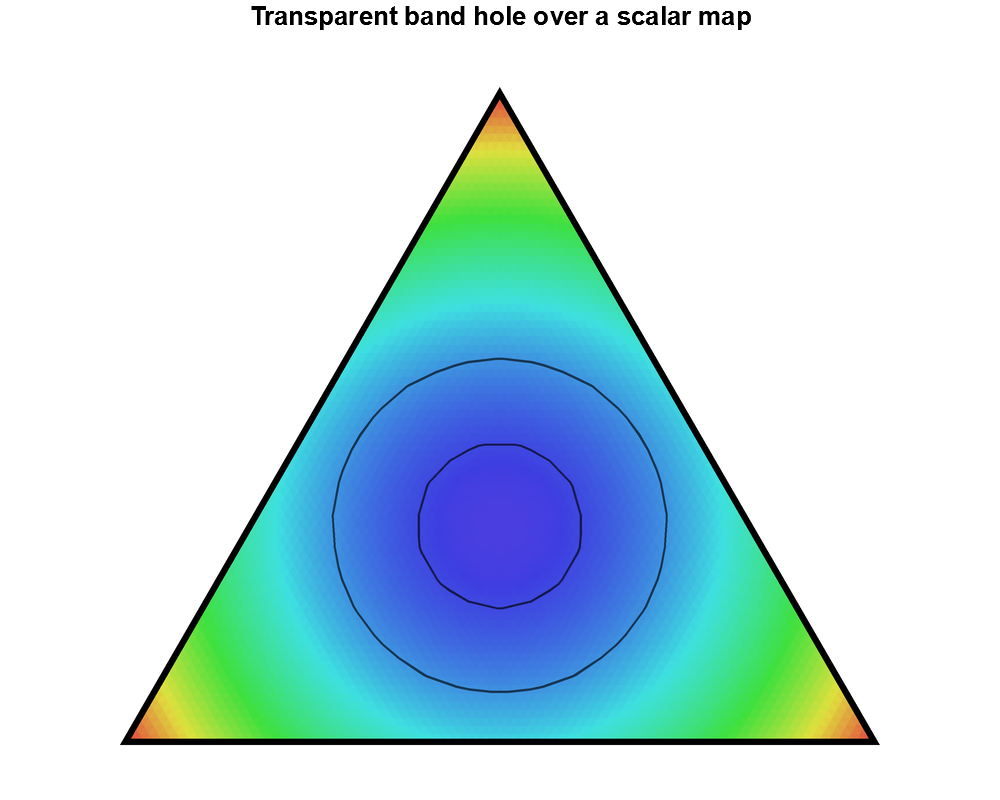
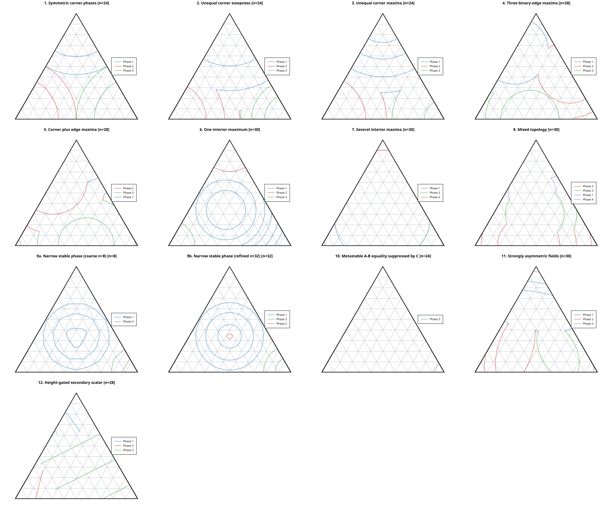

# plotters-ternary

plotters-ternary adds scientific ternary composition diagrams to
[Plotters](https://crates.io/crates/plotters). A ternary diagram represents
three-component compositions (a, b, c) satisfying a + b + c = 1 as a triangle.
It is useful for phase diagrams, alloy systems, geochemistry, compositional
chemistry, and any measurement defined on a three-part mixture.

The crate provides ternary projection, publication-oriented axes and grids,
invisible mathematical viewports, lines, points, scientific markers, polygons,
annotations, regular-grid contours, filled bands, scalar maps, contour labels,
colour bars, PNG output, and native-vector SVG.

## Numerical data and rendering are separate

The companion ternary-contours crate computes final semantic contour paths and
filled-band regions from regular scalar fields. plotters-ternary projects those
coordinates, clips them only for display, and hands ordinary Plotters elements
to the selected backend. Numerical results remain independent of output
dimensions, viewport choice, styles, legends, and PNG supersampling.

The same chart continues to use ordinary Plotters captions, styles, SeriesAnno,
legends, and drawing backends.

## Build a ternary chart

~~~rust,no_run
use plotters::prelude::*;
use plotters_ternary::prelude::*;

fn main() -> Result<(), Box<dyn std::error::Error>> {
    let root = BitMapBackend::new("ternary.png", (1000, 800)).into_drawing_area();
    root.fill(&WHITE)?;

    let mut chart = TernaryChartBuilder::on(&root)
        .caption("Three-component measurements", ("sans-serif", 32))
        .margin(60)
        .build()?;

    let mesh = chart.configure_mesh()
        .corner_a_name("A")
        .corner_b_name("B")
        .corner_c_name("C")
        .build();

    mesh.draw_background(&mut chart)?;
    chart.draw_series(TernaryLineSeries::new(
        [
            TernaryPoint::new(0.70, 0.20, 0.10),
            TernaryPoint::new(0.25, 0.50, 0.25),
        ],
        BLUE.stroke_width(2),
    ))?
    .label("Measured path")
    .legend(|(x, y)| PathElement::new([(x, y), (x + 20, y)], BLUE.stroke_width(2)));

    mesh.draw_foreground(&mut chart)?;
    mesh.draw_text(&mut chart)?;
    chart.configure_series_labels().draw()?;
    root.present()?;
    Ok(())
}
~~~

A TernaryViewport can crop a logical part of the triangle without becoming a
Cartesian frame. Lines, points, polygons, annotations, and contour paths are
mathematically clipped before Plotters draws them.

## Add scalar data

Start with a RegularTernaryScalarField, then choose the representation that
matches the scientific question.

For backend-independent point queries, `FieldInterpolation` and
`InterpolatedTernaryField` are re-exported from `ternary-contours`. They prepare
linear or cubic-alpha numerical evaluation there; this crate only renders the
resulting geometry and does not implement a second scalar interpolator.

### Isolines

TernaryContourSeries draws selected scalar values as paths. Linear contours
are the robust, piecewise-affine baseline. The optional cubic-alpha feature
adds edge-derived cubic-alpha contours when smoother edge behaviour is useful.
Use per-level styles, ordinary Plotters legends, or a ContourColorBar for dense
keys.

### Filled bands

TernaryContourBandSeries draws discrete intervals between ordered scalar
breaks. Their geometry is exact for the piecewise-linear field. Bands can be
disconnected and contain transparent holes that reveal the layer below. They
are useful with a small number of scientifically meaningful intervals.
Cubic-alpha filled bands are intentionally unavailable.

### Scalar maps

TernaryScalarMapSeries covers the domain with colour. It evaluates the
piecewise-linear field exactly, then approximates a smooth-looking gradient by
flat-coloured microtriangles. More resolution reduces faceting but increases
SVG primitive count and file size. It is not a rasterised SVG or a claim of
continuous backend colour interpolation.

| Visual goal | API |
| --- | --- |
| Points or paths | TernaryPointSeries / TernaryLineSeries |
| Selected scalar levels | TernaryContourSeries |
| Phase-labelled stable isotherms | TernaryStableContourSeries |
| Discrete scalar intervals | TernaryContourBandSeries |
| Continuous-looking colour field | TernaryScalarMapSeries |
| Labels following contours | ContourLabelConfig |
| Dense numerical key | ContourColorBar |

## Contour labels and layer order

Contour labels are rendering-time placement decisions: they never change
numerical contour coordinates. Tangent mode rotates one label to the local path
direction. Curved mode positions characters along arc length. Repeated and
manual placements are available, and placement checks endpoint clearance,
curvature, viewport clearance, and collisions. Curved labels use per-character
layout, not full text shaping.

A useful layer order is:

~~~text
scalar map or filled bands
    -> mesh, if desired
    -> isolines
    -> contour labels
    -> annotations
    -> colour bars and legends
~~~

For publication output, SVG retains vector paths and searchable text. PNG
examples use optional geometry-only supersampling; it is an output-quality
technique, not numerical refinement.

## Gallery

### Basic charts, axes, and markers

| Full chart | Axes | Scientific markers |
| --- | --- | --- |
|  |  |  |

### Contours and labels

| Coloured contours | Tangent labels | Curved labels |
| --- | --- | --- |
|  |  |  |

### Filled bands and scalar maps

| Filled bands | Scalar map | Transparent hole over a map |
| --- | --- | --- |
|  |  |  |

SVG counterparts live under examples/output/svg/.


## Stable phase isotherms

`TernaryStableContourSeries` renders the actual phase-labelled paths returned by
`ternary-contours::PreparedStablePhaseEnsemble`. Each synthetic phase supplies
a deterministic liquidus-like height field; the stable phase is the field with
maximum height, and each iso-height path is clipped to that stable region. The
adapter keeps phase colours stable across levels and preserves exact breaks at
ownership changes. Secondary scalars can be rendered through the same result
while stability remains height-defined.

The reproducible gallery covers symmetric and asymmetric corner fields, binary-
edge and interior congruent maxima, narrow coarse/refined resolution, suppressed
metastable equalities, anisotropic fields, and a height-gated secondary scalar.
The SVG is generated by the executable and uses no manually prepared artwork:



Regenerate the combined gallery and individual panels with:

```text
cargo run --release --features stable-contours --example stable_isotherm_gallery
```

See [`ternary-contours` stable-phase documentation](https://github.com/evnekdev/ternary-contours/blob/master/docs/stable-phase-contours.md) for the numerical model and [the generated panel directory](docs/images/stable-isotherms/) for individual cases, including [corner-symmetric](docs/images/stable-isotherms/corner-symmetric.svg), [narrow coarse](docs/images/stable-isotherms/narrow-phase-coarse.svg), [narrow refined](docs/images/stable-isotherms/narrow-phase-refined.svg), and [secondary scalar](docs/images/stable-isotherms/secondary-scalar.svg).
## Features

- Default: charts, geometry, viewports, standard series, linear contours,
  filled bands, scalar maps, labels, legends, and SVG/PNG support.
- cubic-alpha: cubic-alpha contour construction and adaptive topology.
  spline1d also supports the stable smooth-line series API.

## Foreground triangle frame

The ternary simplex edge is the mathematical centreline of the visual frame.
A boundary width is centred on that edge: half lies inside the simplex and half
lies outside it. Lines, contours, polygon outlines, bands, and scalar-map
microtriangles are still clipped to the mathematical domain; a foreground frame
then masks their inner edge in the final rendering.

For publication figures with data, freeze the mesh and draw its phases around
the series. This preserves Plotters-native annotations and legends while making
the correct order explicit:

```rust,ignore
let mesh = chart.configure_mesh()
    .boundary_style(BLACK.stroke_width(8))
    .build();
mesh.draw_background(&mut chart)?; // minor and major grids
chart.draw_series(my_lines)?;
chart.draw_series(my_contours)?;
mesh.draw_foreground(&mut chart)?; // joined physical boundary and ticks
mesh.draw_text(&mut chart)?;       // labels at final text resolution
```

A complete triangle frame is emitted as deterministic filled miter-limited
boundary strips, not as three independently round-capped strokes. In a cropped
viewport only visible physical simplex-edge fragments are drawn; artificial
rectangular viewport sides remain invisible and crop cuts use butt ends. The
PNG geometry pass uses the same order at the supersampled resolution, while SVG
keeps the frame and data as vector geometry. Markers retain their existing
centre-clipping policy. In the recommended workflow they are data geometry, so
the foreground frame masks their inner edge.

## Limits and trade-offs

- No cubic-alpha isobands.
- No irregular or scattered-data triangulation.
- No N-component grids.
- Scalar-map SVG size grows with microtriangle resolution.
- Curved labels use per-character placement rather than full text shaping.
- PNG supersampling affects rendered geometry only, not coordinates or data.

More detailed material is available in
[the architecture notes](docs/architecture/README.md) and
[the numerical knowledge base](docs/knowledge-base/README.md). Contributions
are welcome; see [CONTRIBUTING.md](CONTRIBUTING.md). The crate is dual licensed
under [MIT](LICENSE-MIT) or [Apache-2.0](LICENSE-APACHE).